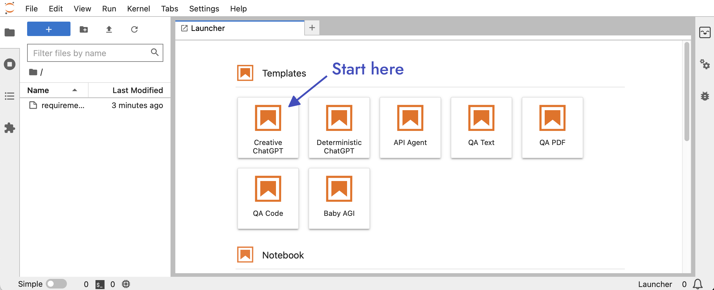
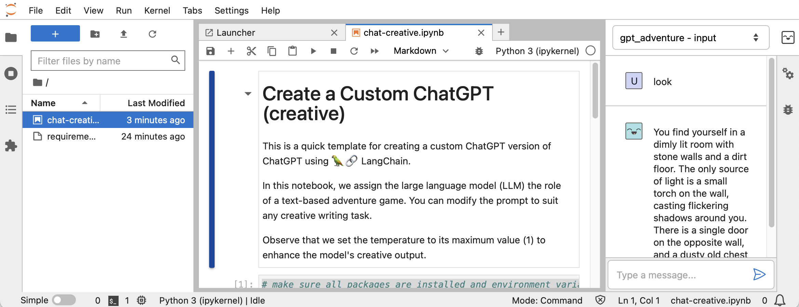
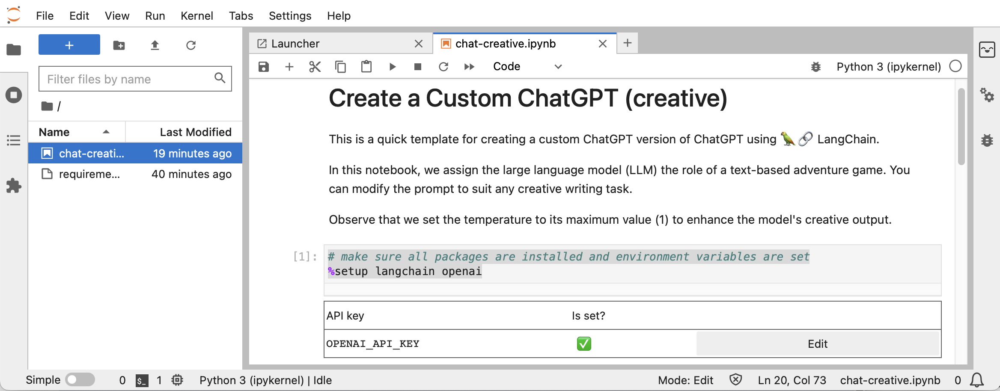

LangForge is an **open-source toolkit** designed to make it easy to create and deploy **_LangChain applications_**.

## Features

- Simplified environment setup and API key management
- Predefined notebooks for various use cases to help you get started quickly
- Instantly chat with your chains using the Jupyter integration
- Automatic REST interface generation for your app

## Installation

To install LangForge, simply run the following command:

```bash
pip install langforge-ai
```

## Getting Started

Use the create command to generate a new LangChain app.

LangForge will ask you a couple of questions, then set up a virtual environment, install required packages, and configure API keys, providing a ready-to-use foundation for your app.

```bash
langforge create myapp
```

When prompted to edit your API keys, input your OpenAI API key.

### Launch JupyterLab

Next, run the langforge lab command to launch Jupyter Lab.

```bash
cd myapp
langforge lab
```

Your project comes with ready-to-use templates for various use cases and an integration that allows you to chat with your chains directly within Jupyter.

In this example, we select the "Creative ChatGPT" template.



### Develop your LangChain app

Now that we have our notebook open, let's run the code.

Select `Kernel > Restart Kernel and Run All Cells...`

This template will make ChatGPT behave like an old school adventure game. To play with it, click the smiling robot face on the upper right to open a chat window.



Great! Note that upon running the first cell, a table displaying your API keys will appear. If your OpenAI key was not set during app creation, simply click the edit button and input your key.

```python
# make sure all packages are installed and environment variables are set
%setup langchain openai
```



Let's change the prompt to customize our adventure. You can come up with any scenario you want. In this tutorial, we will go for a space adventure.

```python
template = """This is a conversation between a human and a system called AdventureGPT.

AdventureGPT is designed to create immersive and engaging text-based adventure games.

AdventureGPT is capable of understanding both simple commands, such as 'look,' and more
complex sentences, allowing it to effectively interpret the player's intent.

This adventure takes place in space. The player steps into the role of Captain Bravado,
a fearless and charismatic leader of the starship 'Infinity Chaser'.
Tasked with navigating the uncharted reaches of the cosmos, Captain Bravado and their
loyal crew must overcome various challenges, solve intricate puzzles, and make critical
decisions that will shape the fate of their mission and the future of interstellar
exploration.
"""
```

Now rerun the cell and find yourself in an immersive space adventure!

### Serve your app

LangForge automatically generates a REST interface for your app, making it easy to deploy and share with others. When you are happy with your app, use the `serve` command followed by the name of your notebook to start serving your app.

```bash
langforge serve chat-creative.ipynb
```

We can now use curl to send HTTP requests to our app:

```
curl -X POST -H "Content-Type: application/json" -d '{"input": "look", "memory": []}' http://localhost:2204/chat/gpt_adventure
```

Note that we include two keys in the JSON: input, which represents the user's command or message, and memory, which holds the conversation history to maintain context and continuity in the interaction.

## Contributing

We welcome contributions from the community! If you'd like to contribute to LangForge, please feel free to submit pull requests or open issues on our GitHub repository.

## License

LangForge is released under the MIT License.
